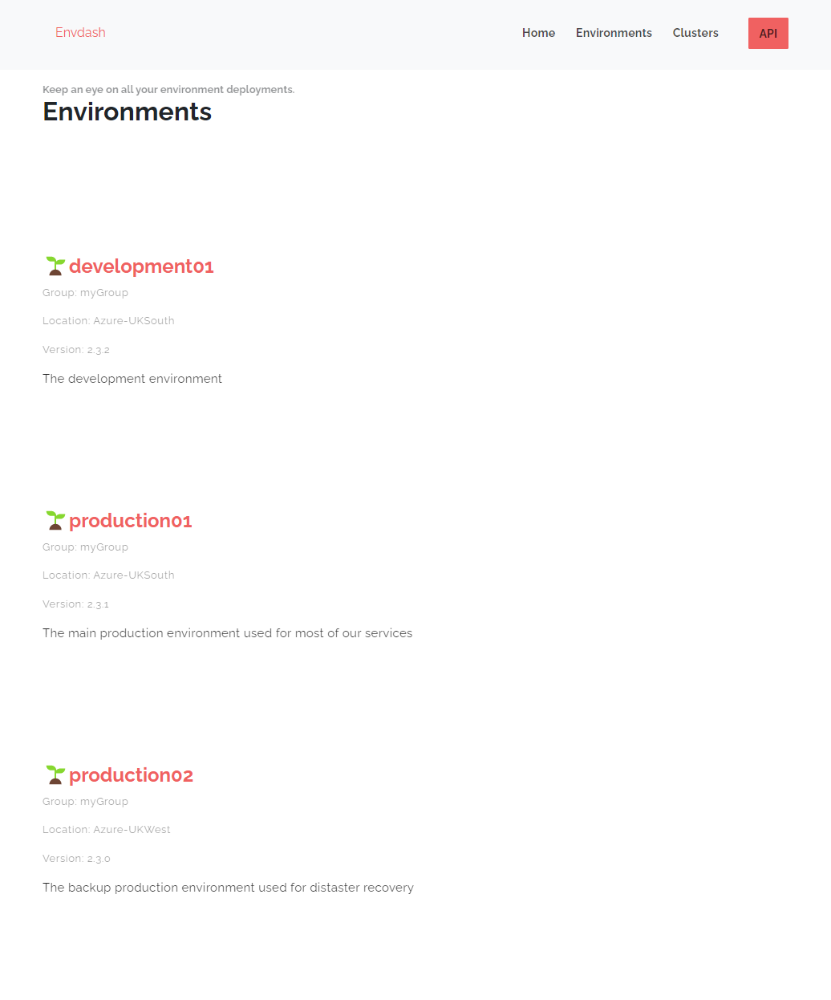
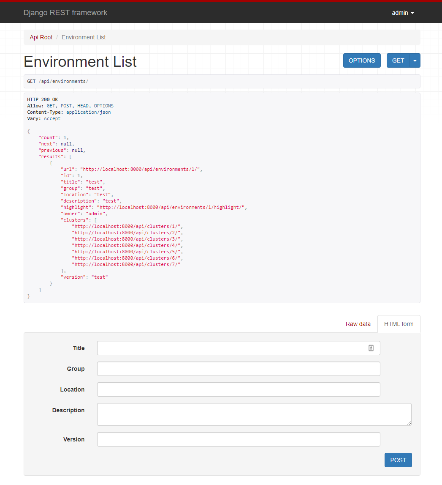

# Envdash

[](https://github.com/DanielMabbett/envdash/actions/workflows/django.yml)
[](https://github.com/DanielMabbett/envdash/actions/workflows/docker-image.yml)


Envdash is an Infrastructure environment dashboard tool. 

The idea is to give groups in your organisation access to see what environment is on what version of the platform release (if you work via releases).

Its lightweight, based on REST commands, so can easily fit into almost any workflow (examples coming).

> Envdash is *not yet production ready*! This is still in a pre-release status.

## Features 

### Dashboard

There are two dashboards (with more improvements coming!)...

One for Environments Overview, and one for Clusters Overview

Overview:
```
https://localhost:8000/
```


Environments:
```
https://localhost:8000/
```


Clicking on an environment will show a detailed view (shows the linked clusters)


Clusters:
```
https://localhost:8000/clusters/
```


### RESTful API 

root
```
https://localhost:8000/api
```


environments
```
https://localhost:8000/api/environments
```


clusters
```
https://localhost:8000/api/environments
```

users
```
https://localhost:8000/api/users
```

Quick example (using admin/admin for username/password): 
```bash
curl --location --request POST 'http://127.0.0.1:8000/api/environments/' \
--header 'Authorization: Basic YWRtaW46YWRtaW4=' \
--header 'Content-Type: application/json' \
--header 'Cookie: csrftoken=3puWbsMc3aUwzqmmoZ6B25d5LqAwwxyC177x3oOfBM0LHwyFcjij7AAIAaU3vDR3' \
--data-raw '{
    "title": "Production001",
    "group": "myInternalGroupName",
    "location": "AzureNorthEurope",
    "description": "This is the main production environment for our company",
    "version": "1.0.2"
}'
```

Response:
```json
{
    "url": "http://127.0.0.1:8000/api/environments/1/",
    "id": 1,
    "title": "Production001",
    "group": "myInternalGroupName",
    "location": "AzureNorthEurope",
    "description": "This is the main production environment for our company",
    "highlight": "http://127.0.0.1:8000/api/environments/1/highlight/",
    "owner": "admin",
    "version": "1.0.2"
}
```

## Getting started 

### Docker

Build:
```sh
docker build . -t envdash
```

Run:
```
docker run -it -p 8020:8020 \
     -e DJANGO_SUPERUSER_USERNAME=envdash \
     -e DJANGO_SUPERUSER_PASSWORD=somePassWordThat1MadeUp? \
     -e DJANGO_SUPERUSER_EMAIL=admin@justanexample.com \
     envdash
```

### Docker Compose 

Build easily with:
```sh
docker-compose build
```

Then run up to start
```sh
docker-compose up
```

### Creating admin user

NOTE: This will improve over time
You will need to run a terminal session into the pod to create your super user:

```bash
python manage.py createsuperuser
```

## Contributors

Contributions are always welcome!
