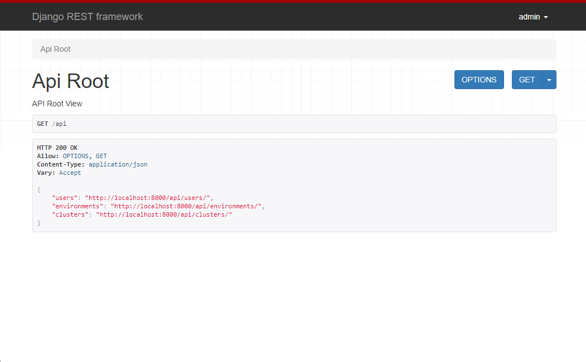

# Env Dash

Envdash is an Infrastructure environment dashboard tool. 

The idea is to give groups in your organisation access to see what environment is on what version of the platform release (if you work via releases).

## Getting started 

### Docker

```
docker build . 
```

### Docker Compose 

```sh
docker-compose build
```

## Features 

### Dashboard

```
https://localhost:8000/
```


### RESTful API 
```
https://localhost:8000/api
```

```
https://localhost:8000/api/environments
```


## Contributors

Contributions are always welcome!